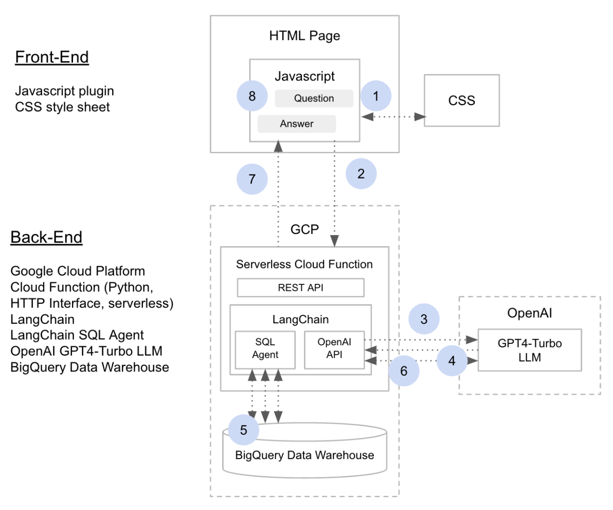

# ra-databot
 
# RA Databot Cloud Function

This is a Google Cloud Function that uses LangChain and OpenAI to provide answers to specific data-related questions.

## Prerequisites

- Google Cloud SDK
- Python 3.10+
- A Google Cloud project with billing enabled
- A BigQuery dataset
- Environment variables set in Google Cloud Secrets Manager. 

## Environment Variables

#### Secrets Manager
- The package uses [Google Cloud Secrets Manager](https://cloud.google.com/security/products/secret-manager) to store environment variables.  
- Functions in the config.py will to get the values for the Cloud Function to run.  
- A sample .env template is included in the root of the package (.env_local_environment_template) for local development.  
- See the Google Cloud [Quickstart](https://cloud.google.com/secret-manager/docs/create-secret-quickstart) documentation for further details.

#### OpenAI API Key
To obtain an API key for your OpenAI API account, follow these steps:

1. Log in to OpenAI:
- Go to the OpenAI website.
- Click on "Sign In" and enter your credentials to log in to your account.

2. Navigate to API Keys:
- Once logged in, select the API menu (rather than ChatGPT).

3. Generate a New API Key:
- Navigate to the API Keys section, click on "Create new secret key".
- Enter a name for your key to identify it later and click "Create key".
- Your new API key will be displayed. Make sure to copy it and store it in a secure place because you won't be able to view it again.

4. Use the API Key in Your Application:
- You can now use this API key to authenticate requests to the OpenAI API. 
- Set the key in your environment variables in Google Cloud Secrets Manager as 'OPENAI_API_KEY' and add the key to your local '.env' file if needed for local development.

## Setup

1. Clone the repository:

    ```sh
    git clone https://github.com/YOUR_USERNAME/ra-databot.git
    cd ra-databot
    ```

2. Deploy the Cloud Function:

    ```sh
    gcloud functions deploy ra-databot \
    --gen2 \
    --runtime python310 \
    --trigger-http \
    --allow-unauthenticated \
    --region YOUR_REGION \
    --set-env-vars GCP_PROJECT=$GCP_PROJECT,BQ_DATASET=$BQ_DATASET,GCP_CREDENTIALS=$GCP_CREDENTIALS,OPEN_AI_MODEL=$OPEN_AI_MODEL,
    OPENAI_API_KEY=$OPENAI_API_KEY
    ```

3. Test the cloud function by using cURL to send a question:

    ```sh
    curl -X POST -H "Content-Type: application/json"  \
    --data '{"question":"and what was it in April 2024?"}' \
    https://YOUR_REGION-YOUR_PROJECT_ID.cloudfunctions.net/ra-databot
    ```

4. Within the chatbot-plugin directory, edit the chatbot.js file and add your cloud function endpoint:

    ```sh
     fetch('https://YOUR_REGION-YOUR_PROJECT_ID.cloudfunctions.net/ra-databot', requestOptions)
      .then((response) => response.text())
      .then((data) => {
        console.log('Received data:', data);
        tempBubble.innerHTML = data; // Replace the temporary bubble content with the actual response
        chatHistory += `Bot: ${data}\n`; // Append bot response to chat history
      })
      .catch((error) => {
        console.error('Error:', error);
        tempBubble.innerHTML = 'Sorry, I could not get the answer. Please try again later.';
      });
        }
    });
    ```

5. To test the chatbot front-end, open the index.html file with your browser and click on the chatbot icon in the bottom right-hand corner of the screen. 


The chatbot dialog will then be displayed and you can start asking questions of your data.

6. To deploy the chatbot front-end, copy the following files to your website:

-   chatbot.css
-   chatbot.js
-   images/agent.png
-   images/go.png
-   images/user.png

    Then add to the <head></head> section of the web pages you want the chatbot to be available on the following HTML code:

    ```
    <link rel="stylesheet" href="https://path/to/your/chatbot.css">
    <script src="https:////path/to/your/chatbot.js">
    ```
# How does it work?



1. User types in a question into the chatbot pop-up dialog interface, for example “How much were our sales in May 2024?”
2. Chatbot Javascript sends the question to the chatbot back-end service via a REST API call
3. Back-end service is a serverless Google Cloud Function which then takes the question and passes it to a LangChain SQL Agent which in-turn passes the question to OpenAI’s GPT4-Turbo LLM, prefixed with the prompt below (change this to be appropriate for your data) to come-up with a strategy to answer the user’s question:

```
    “You are a knowledgeable data analyst working for Rittman Analytics. Answer questions correctly, do not delete or alter any data and provide concise (no more than 10 words) commentary and analysis where appropriate. Use the 

    ra-development.analytics_wide.monthly_company_metrics for monthly summary KPI questions, 
    ra-development.analytics_wide.sales_leads for questions about sales leads,
    ra-development.analytics_wide.website_traffic for questions about website performance,
    ra-development.analytics_wide.sales_deals for sales pipeline and sales activity questions 

    to answer this question, and no other tables. Do not include markdown-style triple backticks in the SQL you generate and try to use or validate. Question is:”
```

4. The GPT4-Turbo LLM then sends back to the LangChain SQL agent running within the Cloud Function a series of SQL Agent tool invocations
5. Those tool invocations first read the database data dictionary, then choose the most suitable table or tables to query, then sample those tables’ contents and then write, test and then execute the correct SQL query to return the answer to the user’s query
6. The results of the SQL query are then sent-back to the GPT4-Turbo LLM so that it can add commentary around the query results
7. Those results are then sent-back to the Javascript app plugin as the REST API response
8. The results are then displayed in the chatbot UI as the answer to the users’ question. If the user asks  further questions as follow-ups to their first question, the Chatbot javascript app appends the results of previous questions in this chat to those follow-up questions so that the LLM has the context of the conversation available to it when formulating its answer.


